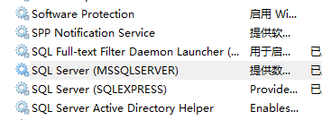
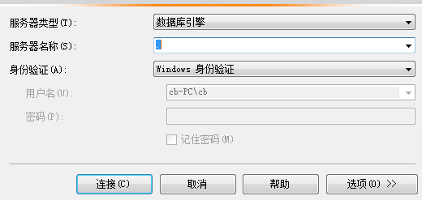
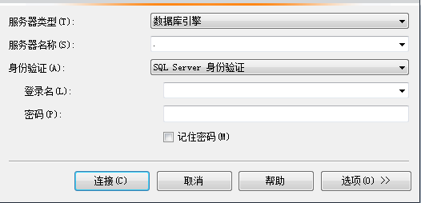
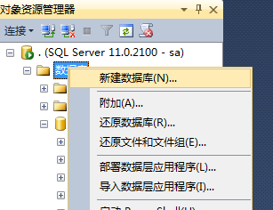
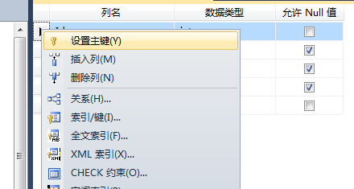
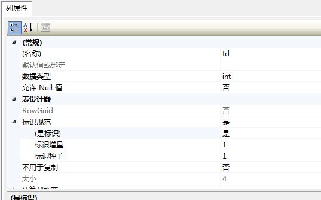
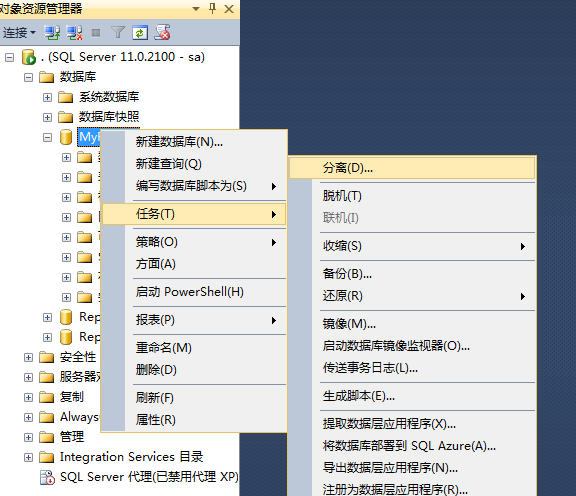
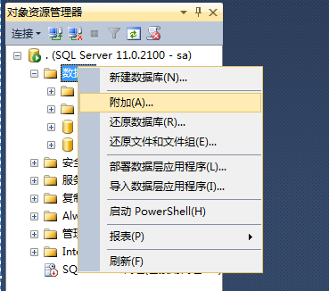
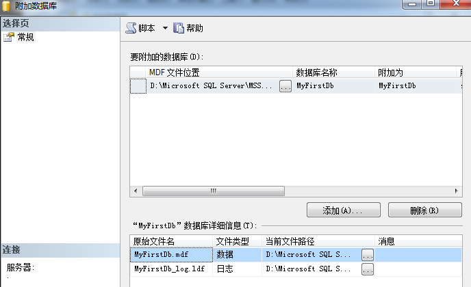

# 数据库第一天

## 目录

[数据库的概念](#数据库的概念)  
[数据库的特点](#数据库的特点)  
[数据库的基本组成](#数据库的基本组成)  
[数据库管理](#数据库管理)  
[可视化创建数据库、表、主键](#可视化创建数据库-表-主键)  
[数据库的字段类型详解](#数据库的字段类型详解)  
[案例 创建School数据库](#案例-创建school数据库)  
[数据库的迁移方案](#数据库的迁移方案)  
[SQL脚本](#SQL脚本)  
[基本的DDL-SQL脚本](#基本的DDL-SQL脚本)  
[基本的DML-SQL脚本](#基本的DML-SQL脚本)  
[案例 OA系统数据库设计](#案例-OA系统数据库设计)  
[约束](#约束)  
[最牛的注释：就是没有注释](#最牛的注释-就是没有注释)  

## 数据库的概念  
- 数据库的概念：数据库就是数据仓库。  
- DBMS:数据库管理系统。`SQLServer`, `Oracle`

返回：[目录](#目录)  

## 数据库的特点  

安全性
并发访问处理
高效率
海量数据存储
数据完整性

要写足够“标准”的数据库编写。考虑将来的迁移。

返回：[目录](#目录)  

## 数据库的基本组成   

数据库本身就是“二维数组”。就像Excel表格那样。
数据库
- 架构（表的分组，多张“表格”）
    - 表
        - 列（Column字段，类型，长度，约束等）
        - 行（Row）
        - 主键：自动增长，GUID
        - 外键

主键（PrimaryKey），就是数据行的唯一标识。这列上面不重复的才能作为主键。为了处理方便，表上面都设置主键。

两种主键：业务主键和逻辑主键。
业务主键：使用有业务意义的作为主键，例如身份证号码，账号。
逻辑主键：没有任何业务意义的字段做主键，给程序用的。

做业务的人不一定能保证业务主键会不会重复，也不能肯定账号会不会升级。推荐使用逻辑主键。

推荐的逻辑主键：  
1、自动逐个增长的数据（例如001,002,003）或者  
2、是GUID（Globally Unique Identifier）当前电脑网卡MAC地址+当前电脑的原子时钟里的时间计算出来  
任何一台电脑在全球任何一个事件算出来的数值都不一样。全球唯一标识。  

表间关联、外键（ForeignKey）：

类似上面表格，讲一张表格拆分成两张表格。表格之间有“厂家编号”来关联。  

返回：[目录](#目录)  

## 数据库管理    

数据库安装
数据库的实例名详解：区分安装在同一台机器上不同的MSSqlServer 服务的。
    
- 混合身份验证：Windows身份验证、SQLServer身份验证  
    - 启用SA账户（安装的时候可以直接设置启用）  
    - 链接数据库：  
        - 保证SQLServer服务器开启  
        - "." 和 （local) 和 机器名一样，代表链接本机。  
        - ip地址：  
            - 回环地址：127.0.0.1  
            - 局域网ip地址，外网ip地址  

  

这里看到“实例名”叫MSSQLSERVER。这是默认的“实例名”

  
默认“实例名”."后面可以啥都没有。

但是要是链接别地地方例如，外网服务器：考虑“SQL Server身份验证”实际工作一般都是这类登录。

    

如果没有选择“混合身份验证”怎么处理：  
1，先用“Windows 身份验证”登录  
2，在“安全”那里找到对应的“sa”用户  
3，修改“sa”用户密码就可以登录了  

返回：[目录](#目录) 

## 可视化创建数据库、表、主键    

链接上数据库服务器之后：1、创建数据库 2、创建表 3、创建列 4、创建主键

1、创建数据库
- 数据库文件默认位置：C:\Program Files\Microsoft SQL Server\MSSQL11.MSSQLSERVER\MSSQL\DATA\
            （创建数据库最好放到此位置，避免权限问题。）

 

2、创建表
&emsp;命名规范同类，表名就是类名。
&emsp;列：
&emsp;&emsp;NChar,Nvarchar(32)      N:Unicode，2个字节表示一个字符。
&emsp;&emsp;Char：一个字节表示一个字符。
&emsp;&emsp;可能遇到的问题：“阻止保存要求重新创建表的更改”的问题，解决办法： 工具→选项→设计器→阻止表的更改
    
&emsp;主键：
电脑上面找到“SQL Server 配置管理器”->“SQL Server 网络配置”
发现三个协议：Shared Memory, Named Pipes（命名管道），TCP/IP 协议（工作中一般用这个）。

返回：[目录](#目录) 

## 数据库的字段类型详解  

image类型：可用来存放图片，图片一般都是单独放文件夹，不太方便放数据库。

设置主键：

在相关列那里，右击就会发现如何设置“主键”。

列属性，“标识规范”。那里选择“是”。可以让主键依次递增。

返回：[目录](#目录)  

## 案例 创建School数据库  

## 数据库的迁移方案   

### 几种迁移方案:  
这里主数据库名字是`MyFirstDb.mdf`,日志文件是`MyFirstDb_log.ldf`  

1. [分离,附加](#分离附加)
2. [脱机,附加](#脱机附加)
3. [备份,还原](#备份+还原)  
4. 生成SQL脚本  

#### 分离,附加  
分离操作：

保证数据库无人使用

分离之后，“数据库”里就不会出现原来的数据库了。

这时候需要进行附加操作：

完成添加操作

使用分离，附加  方法的注意点
&emsp;权限问题  
&emsp;&emsp;启用Administrator账号  
&emsp;&emsp;把数据库文件放到默认的数据库文件存放目录  
&emsp;&emsp;据库文件兼容级别，设置成2005兼容（“数据库属性”中“选项”中进行设置）  

[几种迁移方案](#几种迁移方案)

#### 脱机,附加

#### 备份,还原  

返回：[目录](#目录)

## SQL脚本    
## 基本的DDL-SQL脚本    
## 基本的DML-SQL脚本    
## 案例 OA系统数据库设计    
## 约束    

## 最牛的注释：就是没有注释  
