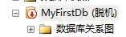
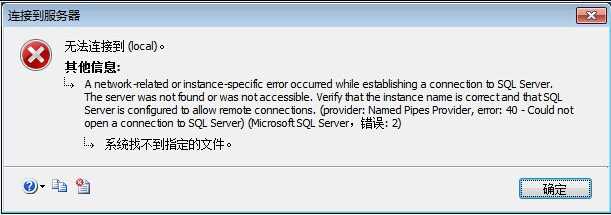

# 数据库第一天

## 目录

[数据库的概念](#数据库的概念)  
[数据库的特点](#数据库的特点)  
[数据库的基本组成](#数据库的基本组成)  
[数据库管理](#数据库管理)  
[可视化创建数据库、表、主键](#可视化创建数据库-表-主键)  
[数据库的字段类型详解](#数据库的字段类型详解)  
[案例 创建School数据库](#案例-创建school数据库)  
[数据库的迁移方案](#数据库的迁移方案)  
[SQL脚本](#sql脚本)  
[基本的SQL脚本操作](#基本的sql脚本操作)   
[案例 OA系统数据库设计](#案例-oa系统数据库设计)  
[约束](#约束)  

## 数据库的概念  
- 数据库的概念：数据库就是数据仓库。  
- DBMS:数据库管理系统。`SQLServer`, `Oracle`

返回：[目录](#目录)  

## 数据库的特点  

安全性
并发访问处理
高效率
海量数据存储
数据完整性

要写足够“标准”的数据库编写。考虑将来的迁移。

返回：[目录](#目录)  

## 数据库的基本组成   

数据库本身就是“二维数组”。就像Excel表格那样。
数据库
- 架构（表的分组，多张“表格”）
    - 表
        - 列（Column字段，类型，长度，约束等）
        - 行（Row）
        - 主键：自动增长，GUID
        - 外键

主键（PrimaryKey），就是数据行的唯一标识。这列上面不重复的才能作为主键。为了处理方便，表上面都设置主键。

两种主键：业务主键和逻辑主键。
业务主键：使用有业务意义的作为主键，例如身份证号码，账号。
逻辑主键：没有任何业务意义的字段做主键，给程序用的。

做业务的人不一定能保证业务主键会不会重复，也不能肯定账号会不会升级。推荐使用逻辑主键。

推荐的逻辑主键：  
1、自动逐个增长的数据（例如001,002,003）或者  
2、是GUID（Globally Unique Identifier）当前电脑网卡MAC地址+当前电脑的原子时钟里的时间计算出来  
任何一台电脑在全球任何一个事件算出来的数值都不一样。全球唯一标识。  

表间关联、外键（ForeignKey）：


类似上面表格，讲一张表格拆分成两张表格。表格之间有“厂家编号”来关联。  

返回：[目录](#目录)  

## 数据库管理    

数据库安装
数据库的实例名详解：区分安装在同一台机器上不同的MSSqlServer 服务的。
    
- 混合身份验证：Windows身份验证、SQLServer身份验证  
    - 启用SA账户（安装的时候可以直接设置启用）  
    - 链接数据库：  
        - 保证SQLServer服务器开启  
        - "." 和 （local) 和 机器名一样，代表链接本机。  
        - ip地址：  
            - 回环地址：127.0.0.1  
            - 局域网ip地址，外网ip地址  

  

这里看到“实例名”叫MSSQLSERVER。这是默认的“实例名”

  
默认“实例名”."后面可以啥都没有。

但是要是链接别地地方例如，外网服务器：考虑“SQL Server身份验证”实际工作一般都是这类登录。

    

如果没有选择“混合身份验证”怎么处理：  
1，先用“Windows 身份验证”登录  
2，在“安全”那里找到对应的“sa”用户  
3，修改“sa”用户密码就可以登录了  

返回：[目录](#目录) 

## 可视化创建数据库、表、主键    

链接上数据库服务器之后：1、创建数据库 2、创建表 3、创建列 4、创建主键

1、创建数据库
- 数据库文件默认位置：C:\Program Files\Microsoft SQL Server\MSSQL11.MSSQLSERVER\MSSQL\DATA\
            （创建数据库最好放到此位置，避免权限问题。）

 

2、创建表
&emsp;命名规范同类，表名就是类名。
&emsp;列：
&emsp;&emsp;NChar,Nvarchar(32)      N:Unicode，2个字节表示一个字符。
&emsp;&emsp;Char：一个字节表示一个字符。
&emsp;&emsp;可能遇到的问题：“阻止保存要求重新创建表的更改”的问题，解决办法： 工具→选项→设计器→阻止表的更改
    
&emsp;主键：
电脑上面找到“SQL Server 配置管理器”->“SQL Server 网络配置”
发现三个协议：Shared Memory, Named Pipes（命名管道），TCP/IP 协议（工作中一般用这个）。

返回：[目录](#目录) 

## 数据库的字段类型详解  

image类型：可用来存放图片，图片一般都是单独放文件夹，不太方便放数据库。

设置主键：


在相关列那里，右击就会发现如何设置“主键”。


列属性，“标识规范”。那里选择“是”。可以让主键依次递增。

返回：[目录](#目录)  

## 案例 创建School数据库  

大致需求：  
1. 创建一个 School 数据库  
2. 创建一个班级表：  
TblClass: 
tClassId,tClassName, tClassDesc
3. 学生信息表：  
TblStudent: tSId,tSName, tSGender, tSAddress,
tSPhone,tSAge, tSBirthday, tSCardId, tSClassId  
4. 分离数据库,对数据库进行附加  

注意，字符长度要是2的整数幂。例如`nvarchar(32)`  
关于数据的删除，应该都是用`软删除`，也就是表面上看`删除`了。但是事实上，数据库内部还存在。数据只要进了数据库就不会被删除。而为了做这个软删除，需要做一个标志位，常用字段DelFlag。如果数据真的太多了，那就迁移出来进行备份。


```
nvarchar(n) ：包含 n个字符的可变长度 Unicode 字符数据。n的值必须介于 1  与  4,000 之间。字节的存储大小是所输入字符个数的两倍。所输入的数据字符长度可以为零。
varchar[(n)]：长度为 n 个字节的可变长度且非 Unicode的字符数据。n 必须是一个介于1和8,000之间的数值。存储大小为输入数据的字节的实际长度，而不是 n 个字节。所输入的数据字符长度可以为零。
```  

## 数据库的迁移方案   

### 几种迁移方案:  
这里主数据库名字是`MyFirstDb.mdf`,日志文件是`MyFirstDb_log.ldf`  
以下四种以“生成SQL脚本”最为保险：  
1. [分离,附加](#分离附加)
2. [脱机,附加](#脱机附加)
3. [备份,还原](#备份还原)  
4. [生成SQL脚本](#生成sql脚本)  

#### 分离,附加  
分离操作：  


保证数据库无人使用  


分离之后，“数据库”里就不会出现原来的数据库了。

这时候需要进行附加操作：  


完成添加操作    


使用分离，附加  方法的注意点
&emsp;权限问题  
&emsp;&emsp;启用Administrator账号  
&emsp;&emsp;把数据库文件放到默认的数据库文件存放目录  
&emsp;&emsp;据库文件兼容级别，设置成2005兼容（“数据库属性”中“选项”中进行设置）  

[几种迁移方案](#几种迁移方案)

#### 脱机,附加
脱机处理，就是指。将原来正在访问的数据库“脱机”了。因为在链接状态下，`mdf` 和 `ldf`文件都不允许轻易的移动。必须先脱机处理。  
在相关数据库，右击选择“任务”选择“脱机”。如果想恢复，就选择“联机”。  

  
和 “分离,附加” 这类方法很接近。    

[几种迁移方案](#几种迁移方案)  

#### 备份,还原  

备份处理，也是在相关数据库中，右击选择“任务”，选择“备份”。会在`Backup`文件夹下面生成 `bak` 文件。

客户在使用的时候，需要先自己手动创建，相同名字的数据库。客户在创建好数据库之后，右击“任务”，选择“还原”中的“文件和文件组”。如果使用“数据库”的话可能会失败。要注意“覆盖现有数据库”

[几种迁移方案](#几种迁移方案)  

#### 生成SQL脚本  

数据库右击，找到“任务”，选择“生成脚本”。

设置脚本编写选项  
    

[几种迁移方案](#几种迁移方案)  

返回：[目录](#目录)

## SQL脚本  

SQL 全名是结构化查询语言（```Structured Query Language```），是关系数据库管理系统的标准语言。各类数据库都认。  

SQL 主要分DDL(数据定义语言，建表，建库等语句)、DML(数据操作语言)和DCL(数据库控制语言)。  
Create Table、Drop Table、Alter Table等属于DDL，Select、Insert、Update、Delete等属于DML，GRANT授权、REVOKDE取消授权属于DCL。  

《[DQL、DML、DDL、DCL的概念与区别](https://www.cnblogs.com/fan-yuan/p/7879353.html)》    

脚本：一般就是指比较简单的，不需要编译的可以直接解析执行的语言，常见的有：SQL、JavaScript等。  
&emsp;T-SQL的特点：  
&emsp;&emsp;跨DBMS(Database Management System)，基本上所有的DBMS都对标T-SQL兼容。  
&emsp;&emsp;大小写不敏感(仅仅是关键字不敏感，字符串数据是大小写敏感的)    
&emsp;&emsp;转义  

返回：[目录](#目录)  

## 基本的SQL脚本操作  

```{.line-numbers}  
数据定义语言DDL（ Data definition language ）:是SQL语言的一个分类，用于对数据库对象（表、视图、序列等）进行创建、修改、删除等操作。
通过以下几个关键字实现：
CREATE（新建）、 ALTER（修改） DROP（删除） RENAME（重命名） TRUNCATE（截断）
```  

- 创建数据库(Create Databas)：  
- 创建表(包括主键、自动增长、是否可空)等：  

创建数据库(Create Databas)：  
点击“新建查询”，创建新的sql脚本语言。  
  

新脚本保存的时候别忘了看看保存的位置，保存成功之后点击“执行(F5)”自然就可以生成对应的数据库。    
  

SQL脚本创建表：    
  


```sql{.line-numbers}  
-- 自动增长的主键
use PhpDb
go
create table Test2
(
	Id int identity(1,1) primary key not null,
	Name nvarchar(32) null
)
go
```

```sql{.line-numbers}  
--基本查询
select * from dbo.Test2
```
如果是想写全所有的列，也可以不用`*`号显示。按住`表`里面的`列` 拖到`*` 所在的位置就可以了。这样可以确保到底要搜寻什么是清楚的。  


```sql{.line-numbers}  
--查找EmpId大于111的那一列
select EmpId, EmpName, EmpAge, DelFlage from dbo.Employee where EmpId>111 
``` 

小总结：  
```sql{.line-numbers}  
--01:创建数据库
create datbase PhpDb2;

--02:删除数据库
drop database PhpDb2;

--03:创建数据库
create database DemoDb
on --放数据库文件的设置
(
	name='DemoDb', --保证逻辑名字name和数据库名字一致
	size=5MB,
	filegrowth=2MB,
	fileName='D:\Microsoft SQL Server\MSSQL11.MSSQLSERVER\MSSQL\DATA\DemoDb.mdf'
)
log on --放数据库的日志文件
(
	name='DemoDb_log', 
	size=2MB,
	filegrowth=2MB,
	fileName='D:\Microsoft SQL Server\MSSQL11.MSSQLSERVER\MSSQL\DATA\DemoDb_log.ldf'
)

--04:创建表
use PhpDb
go
create table Employee
(
	EmpId int primary key not null, --主键
	EmpName nvarchar(32) null,
	EmpAge int default(18) not null,
	DelFlage smallint default(0) null
)
go

--05:基本查询
select * from dbo.Employee
select EmpId, EmpName, EmpAge, DelFlage from dbo.Employee where EmpId>111 

--06: crud: 增删查改数据库的主要工作 (create read update delete)
--Insert Select Update Delete
--插入操作
--Insert into 表名(列名1，列名2，列名3.。) values(值1,值2, ...)

use PhpDb;
go
insert into dbo.Employee
(EmpId, EmpName, EmpAge, DelFlage, EmpPhone) 
values(32,N'小来',22,0,'123456');
--N表示是Unicode编码
go

--07: 插入自动增长的列的数据
insert into dbo.Test2(Name) values(N'康师傅');

--08: 插入日期
use PhpDb;
insert into dbo.Test2(Name,Birthday) values(N'西红柿',getdate());

--09: 删除,一定要有where
delete from dbo.Test2 where 1=1
--没有where相当于全部删掉
--delete 执行之前必须要先备份,误删的可能就得用日志恢复.比较麻烦
--就算真的是表全部删掉也要有'where 1=1'

--删除做的少，优先考虑用修改
--10: 修改 update 表名 set 列名=值 where 条件表达式
update dbo.Test2 set Name=N'老王' where id=3;
--没有where所有的数据都会被改掉
```

返回：[目录](#目录)  

## 案例 OA系统数据库设计  
OA就是电子办公系统，大致有：部门表、员工表、内部员工消息表(内部员工沟通)。  

部门表:Department JQJB:警情级别  
&emsp;部门的名字(DepName)  
&emsp;部门的领导(DepMaster)  
&emsp;部门的编号 主键(PrimaryKey)  
&emsp;部门的描述  
&emsp;删除标识  
&emsp;上级部门的ID(部门的层级设计考虑)  
&emsp;&emsp;select * from dep where ParentDepId=我的id  
&emsp;&emsp;这么处理可以形成一个"树状结构"。  
员工表    
内部员工消息表  
&emsp;发送者    
&emsp;发送的时间    
&emsp;发送的内容  
&emsp;接收    
&emsp;接收时间  

```sql{.line-numbers}  
--OA项目数据库案例
--创建数据库 OADB
create database OADB;
go
use OADB
go
--创建部门表
create table Department
(
	--部门主键列
	DepId int identity primary key not null,
	DepName nvarchar(32) null,
	DepMasterId int null,
	DepRemark nvarchar(512) null,
	ParentDepId int null,
	DelFlage smallint default(0) not null,	
)
```  

返回：[目录](#目录)  

## 约束  
数据在存储之前，先进行检查。看看是否满足约束。以性能换安全(数据的完整性)，但是一般都是在代码部分实现约束。  

主键约束、默认值约束、`唯一约束`(例如部门表中不允许有重复部门名字)  
`外键约束`  

唯一约束(例如部门表中不允许有重复部门名字)  
唯一约束需要先`创建索引`,然后添加新的索引。  

为了唯一约束创建索引  


添加新索引  


《[关于数据库主键和外键](https://blog.csdn.net/f45056231p/article/details/81070437)》  

外键约束:  
在需要`跳转`到的外键表那里设置新外键  

  
外键约束确定外键关系，但是别忘了必要的主键设置  
  

返回：[目录](#目录)  

##  备注  

系统找不到指定的文件  
  
首先需要看一下sqlserver服务启动了没有。联接的是本地的服务器，那么本地确认安装了数据库服务器。  

无比确保`MSSQLSERVER`服务已经启动  
  


《[如何开启Sql Server 服务](https://jingyan.baidu.com/article/3f16e003153ca52591c10387.html)》  

