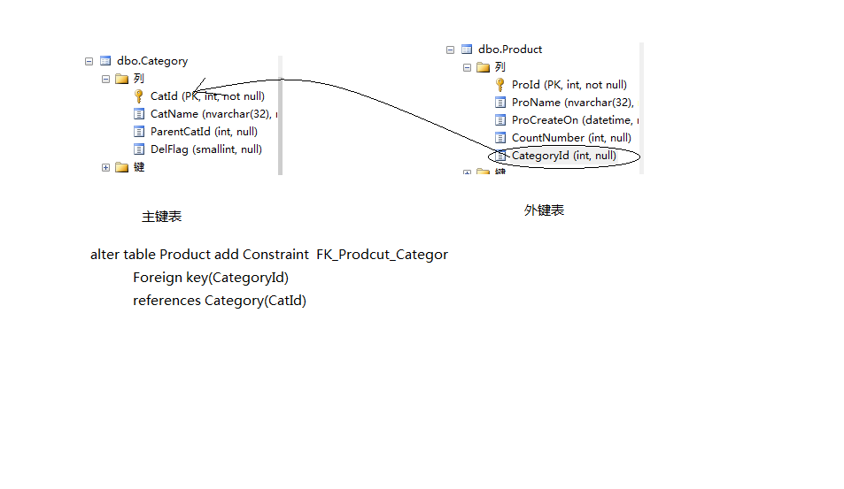

# 数据库第二天  

## 目录

[复习](#复习)  
[约束详解](#约束详解)  
[Select查询详解](#select查询详解)  
[类型转换](#类型转换)  
[表联合](#表联合)  
[一次性插入多条数据](#一次性插入多条数据)  
[日期函数](#日期函数)  
[字符串函数的使用](#字符串函数的使用)  
[练习](#练习)  

附录：  
[代码参照]()  

## 复习  

数据库的创建步骤：  
&emsp;创建数据库的SQL：  
&emsp;创建表的SQL语句：    
&emsp;NChar和Char的区别：  
&emsp;数据库的实例名怎么理解：  
&emsp;select, delete, update, Insert：  

创建数据库的SQL:  

```sql{.line-numbers}  
create database 数据库名
--下面这段内容也不是必须要写的，有也无妨。
on
(
	name='',
	size=5MB,
	filegrowth=2MB,
	filename="....\data\db.mdf"
)
log on
(
	name='_log',
	size=5MB,
	filegrowth=2MB,
	filename="....\data\db_log.ldf"
)
```  

创建表的SQL语句:    
```sql{.line-numbers}  
create table 表名
(
	列名 类型 null,
	.....,
	列名  类型 primaryt key not null,--主键列
	
	列名  类型 identity(1,1) not null,--自动增长,只能用于数据的类型：int，bigint,float	
)
```
NChar和Char的区别:
`NChar` 的 `N` 表示存储的是Unicode数据类型的字符。两个字节存储一个字符，避免乱码。  

《[char和nchar，varchar和nvarchar的区别（转载）](https://www.cnblogs.com/henuliulei/p/9744790.html)》  

数据库的实例名怎么理解：  
`SQL Server(MSSQLSERVER)` 中 `MSSQLSERVER`表示默认的数据库实例名。  
一台机器上的不同的数据库，通过服务实例来区分。  

select, delete, update, Insert：  
```sql{.line-numbers} 
select 列名，....  from 表 where 表达式1 and 表达式2
--delete一定不要忘了加 where 条件
delete from 表 where 表达式1 and 表达式2              
update 表名 set 列1=值，列2=值                         
insert into 表名(列1，列2...) values(值1，值2...)    
```

返回：[目录](#目录)  

## 约束详解  

约束的目的：保证数据的完整性,非空约束(not null)。但是校验的过程本身也降低了效率。  
默认值约束、可空约束、主键约束、外键约束、唯一键约束、检查约束。 
alter table 添加列，修改列，删除列:不是重点。  

```sql{.line-numbers} 
--给数据库的表添加一列
--alter table 表名 add 列名 类型 null
alter table dbo.UserInfo add [Address] nvarchar(32) null
go
alter table dbo.UserInfo add [DelFlag] smallint null
go

--代码的方式:给列添加默认值约束
--alter table 表名 add constraint 约束的名字 default(0) for DelFalg
alter table dbo.UserInfo add constraint DF_UserInfo_DelFlag default(0) for DelFlag
go
--添加数据
insert into UserInfo([Address]) values(N'中关村')
go
```

语法上，添加约束和添加列非常接近：  
```sql{.line-numbers}  
--给数据库的表添加一列
--alter table 表名 add 列名 类型 null
alter table dbo.UserInfo add [Address] nvarchar(32) null
go
alter table dbo.UserInfo add [DelFlag] smallint null
go
```
```sql{.line-numbers}  
--数据库的表删除一个列
--删除之前要解决约束
alter table UserInfo drop constraint DF_UserInfo_DelFlag
go
alter table UserInfo drop column DelFlag
go
```

```sql{.line-numbers}  
--修改一个列
alter table UserInfo alter Column [Address] nvarchar(64) null
```

主键约束:  
```sql{.line-numbers}  
create table Product
(
	ProId int identity(1,1) not null,
	ProName nvarchar(32) null,
	ProCreateOn DateTime default(getdate()),
)
go

--给表创建一个主键
alter table Product add constraint PK_Product_ProId primary key(ProId)
```

外键约束:  
商品属于某个外键列。  
```sql{.line-numbers}  
--分类表 和商品关系
--一个分类有多个商品，一个商品只属于一个分类
create table Category
(
	CatId int identity(1,1) primary key not null,
	CatName nvarchar(32) null,
	ParentCatId int null,
	DelFlag smallint default(0) null
)
go
```
有外键链的表是外键表，如果只有主键的话就是主键表。  

  

返回：[目录](#目录)  

## Select查询详解  
&emsp;
- select 后面可以跟常量（数字/字符串），系统函数，表达式，列名 .... 
- 查询结果的别名  
	- 列 as 别名(建议用这种)  
	- 列 别名  
    - 别名=列  
- 聚合函数(可参照数据库->可编程性->系统函数)  
	- Avg()  
	- Count()  
	- Sum()  
	- Min()/Max()  
	- Group  
- Top截取和Order 排序  
- 去除重复:Distinct  
	- --distinct只能紧跟select后面，而且是对后面的所有的列都进行去重复操作  
- where条件过滤  
	- 常见的表达式过滤：比如 ，select * from 表 where Id>10  
	- 多条件过滤： and or not（优先级：not > and >or）  &&  ||  !  
	- 区间过滤：between and   和 in  
	- 模糊查询  
		- like查询语法  
		- 针对字符串查询的通配符： %  _   []  
		- 特殊字符转义。‘’  和 [   
	- 空值处理：  
		- 列=Null的结果  
		- is null和is not  null  

查询函数select：  
```sql{.line-numbers}
--select 查询
select 1000*0.1+10+2009 as 钱
--给列起别名
select 钱=12*12 --不推荐
--表中有多少行进行统计
select count(*) from Product
--count可以是字段，列 count(1) count(2)
--count(*)表示取表中最短的列进行行统计个数
--count(1) count(1) count('ss')对常数列进行行统计个数
```
聚合函数:  
```sql{.line-numbers}
use ItcastDb
select * from tblScore
--求平均数Avg() score1是表tblScore里面的列
select avg(score1) from tblScore
--求两个平均值
select avg(score1) as 成绩1,avg(score2) as 成绩2 from tblScore
```

Top截取和Order 排序:  
```sql{.line-numbers}
--只需要前三条 一般都是选择默认排序的前面几条
select top 3 * from tblScoresql
--根据scoreId进行排序 orderss 并且是升序
select * from tblScore order by scoreId asc
--根据scoreId进行排序 orderss 并且是降序
select * from tblScore order by scoreId desc
--根据score1进行降序排列，如果存在一样的那么参照score2中的降序
select * from tblScore order by score1 desc,score2 desc
--成绩1前三名的取出
select top 3 * from tblScore order by score1 desc
```
去除重复:Distinct  
```sql{.line-numbers}
select distinct score1 from tblScore
```

where条件过滤  
```sql{.line-numbers}
--多条件过滤： and or not（优先级：not > and >or）  &&  ||  !
select * from SalesLT.Customer
	where 
	CustomerID<100 and Title<>'Ms.' or MiddleName='N.'
	-- <> 这里表示!=

--区间过滤：between and   和 in
select * from SalesLT.Customer
	where CustomerID between 20 and 50

--模糊查询
--要求：把所有FisrtName中以  Jac 开头的数据都查询出来
--这部分需要配合上正则类型的通配符
select * from SalesLT.Customer
	--where FirstName like 'Jac%' --%任意多个字符，通配符
	where FirstName like '%o%' --存在一个字符o

--查询middlename 是null的数据
select * from SalesLT.Customer	where MiddleName is null
--where MiddleName=null表示条件是'不知道'
--null空值处理需要另外处理

```

返回：[目录](#目录)  

